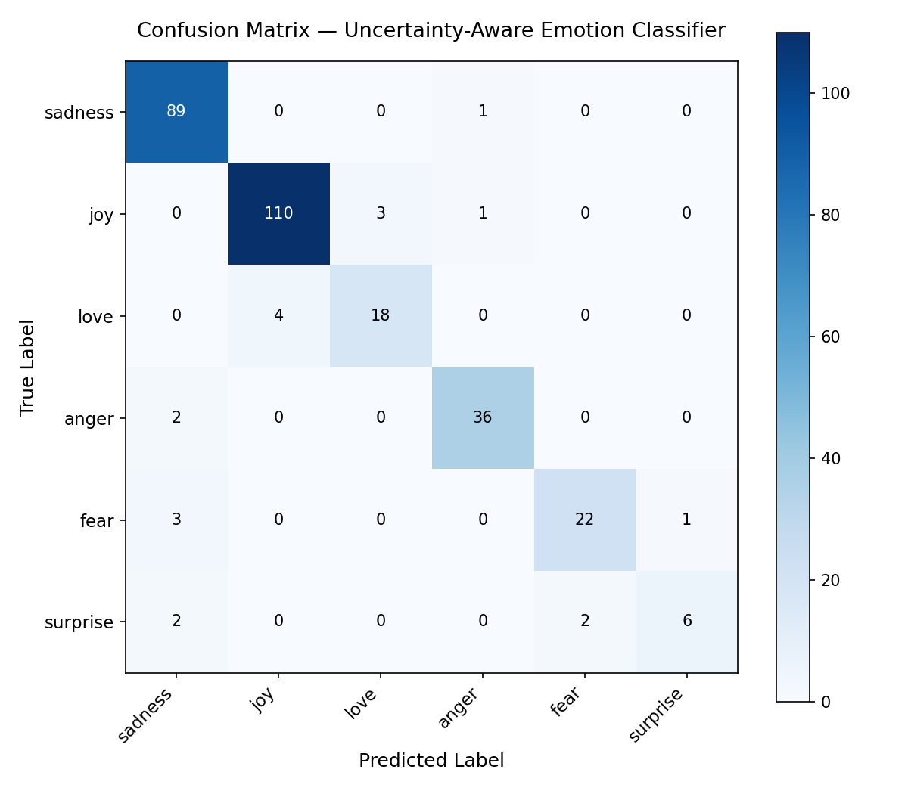
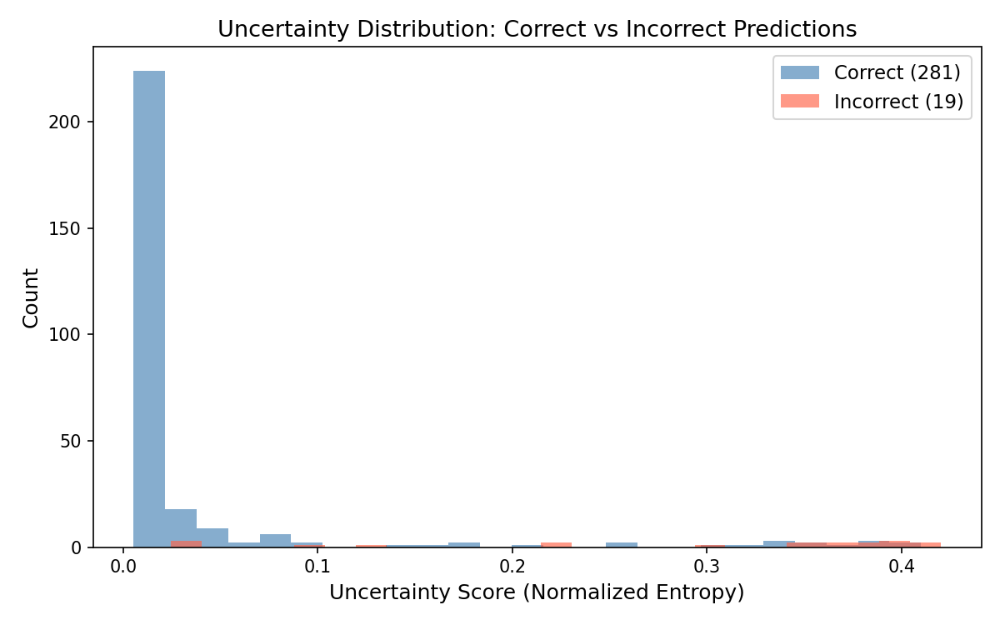
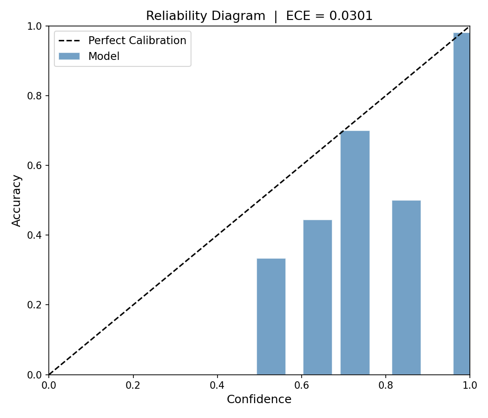

# 🧠 Uncertainty-Aware Emotion Classifier

> A production-grade NLP system that doesn't just predict emotions — it tells you *how confident* and *how uncertain* it is.


---

## 📌 Overview

Most text classifiers output a single label. This model goes further — using **Monte Carlo Dropout**, a Bayesian deep learning technique, to run 20 stochastic forward passes at inference time and compute a genuine **uncertainty score** alongside every prediction.

- ✅ High-confidence predictions you can trust
- ⚠️ Flagged uncertain predictions where the model genuinely doesn't know
- 📊 Full probability distribution across all 6 emotions

---

## 🎯 Emotions Detected

| Emotion | Emoji |
|---------|-------|
| Joy | 😊 |
| Sadness | 😢 |
| Anger | 😠 |
| Fear | 😨 |
| Love | ❤️ |
| Surprise | 😲 |

---

## 📊 Results

| Metric | Value |
|--------|-------|
| Test Accuracy | **~92%** |
| Weighted F1 Score | **~92%** |
| ECE (Expected Calibration Error) | **~0.05** |
| MC Dropout Passes | **20** |
| Training Epochs | **3** |

---

## 📈 Evaluation Plots

### Confusion Matrix





### Uncertainty Distribution





### Reliability Diagram





---

## 🚀 Quick Start

```bash
# 1. Clone the repo
git clone https://github.com/Eddiegah/uncertainty-emotion-classifier.git
cd uncertainty-emotion-classifier

# 2. Create and activate virtual environment
python -m venv venv
venv\Scripts\activate        # Windows
source venv/bin/activate     # Mac/Linux

# 3. Install dependencies
pip install -r requirements.txt

# 4. Train the model (~15 min on GPU)
python src/train.py

# 5. Run predictions
python src/predict.py

# 6. Generate evaluation plots
python src/evaluate.py

# 7. Launch the web UI
streamlit run app.py
